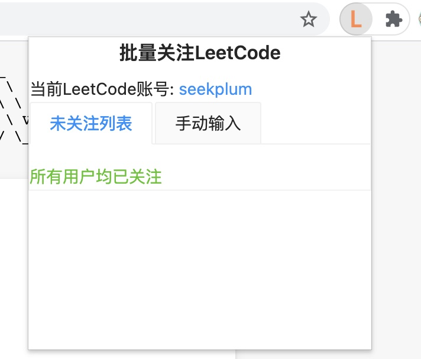
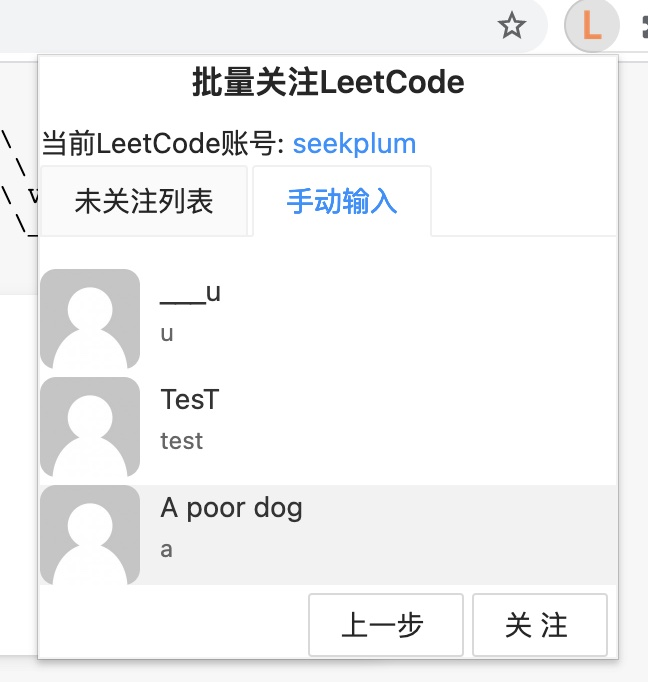

# 批量关注 LeetCode

[](https://travis-ci.com/seekplum/leetcode-chrome-extension) [](https://david-dm.org/seekplum/leetcode-chrome-extension) [](https://david-dm.org/seekplum/leetcode-chrome-extension?type=dev) [](https://snyk.io/test/github/seekplum/leetcode-chrome-extension?targetFile=package.json) [](http://isitmaintained.com/project/seekplum/leetcode-chrome-extension)

## :sparkles: 前言

当前项目基于[一个超棒的基于 React & TypeScript & webpack 的 chrome 扩展开发模板](https://github.com/tjx666/awesome-chrome-extension-boilerplate)进行开发，目的是可以快捷批量的关注 LeetCode 账号。

0.自动获取关注者中未关注的用户



1.手动输入要关注的用户



## :package: 安装说明

0. 必须是 Chrome 浏览器
1. 点击右侧[Release 链接](https://github.com/seekplum/leetcode-chrome-extension/releases)，选择最新版本的 `leetcode-chrome-extension-v<版本号>.zip` 包
2. 解压到本地，推荐解压到不易被删除的地方(Windows 推荐 `C:\Users\用户名`，macOSX 用户推荐 `/Users/用户名`，Linux 用户推荐 `/home/用户名`)
3. Chrome 打开 [chrome://extensions/](chrome://extensions/) 地址，选中右上角的`开发者模式`
4. 检查插件列表里是否已经有 `批量关注LeetCode`，如果有，点击删除以避免冲突
5. 点击 `加载已解压的扩展程序` 选项(如果没有，检查右上角的`开发者模式`)，然后选中刚才解压的目录

## :hammer_and_wrench: 开发

```bash
# 克隆当前项目
git clone https://github.com/seekplum/leetcode-chrome-extension.git

# 安装依赖，推荐使用 yarn
yarn
```

### 启动 devServer

```bash
yarn start
```

### 调试

- 1.访问 http://127.0.0.1:3600/popup.html
- 2.安装后通过 Chrome 插件页面访问 chrome-extension://<插件 ID>/popup.html

## :construction_worker: 打包

构建生产级别的包直接运行：

```bash
yarn run build
```

如果你想分析打包情况：

```bash
yarn run build-analyze
```
